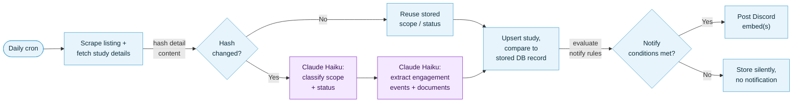

# Deterministic AI Pipelines

I was recently speaking with a friend about his AI setup, and it got me thinking about how often we treat AI as a "one-and-done" interaction. There's a massive tendency to want AI to do everything in one go—from scraping the data to performing the final action. When we rely on these "agentic" workflows, we often run into issues with reliability and unpredictable costs.

For example, my friend has scripts that utilize LLMs to caption his YouTube videos—a practical use case. I have an agent skill to automate PR creation, summarize changes, and update Jira work items. It's a great workflow, but it's fragile. Sometimes it fails to locate the Atlassian MCP tools, or security protocols block the server, and I need to manually intervene.

These experiences led me to a simple question: What if we stopped relying on the AI to act as the "driver" of the entire process? Instead of asking an AI to do everything, it's often faster and more reliable to use AI for the "thought" work—like generating summaries—while keeping the execution logic in a standard, deterministic script.

## The Case for Deterministic Orchestration
There is a powerful middle ground between manual labour and fully autonomous agents: Deterministic Orchestration.
By decoupling the AI's "inference" (the heavy lifting of understanding text) from the "orchestration" (the scraping, API calls, and database management), we gain much more control. This separation of concerns means that if the AI fails, your pipeline doesn't necessarily crash—and if your API call fails, you aren't stuck re-running expensive LLM prompts.

A non-deterministic approach makes sense for fast iteration when prototyping a workflow or identifying solutions. However, it can be fragile; behaviours may vary across models, and performance can shift over time as models are updated.

## In Practice: The Safe Streets Halton Project
I currently maintain a Deno pipeline that runs daily at 6:00 p.m. to scrape municipal websites for transportation-related engagement opportunities, such as events and environmental assessments. A major challenge in open data is the lack of standardized formats; every municipality in the Halton region structures their data differently.

Instead of building a brittle agent to handle this, I use a specific, reliable pipeline:
1. **Parsing:** The script scrapes the HTML body content, and extracts the relevant detail sections to provide to the LLM.   
   **Idempotency:** To avoid redundant processing and unnecessary costs, I hash the relevant detail section. Before sending anything to an LLM, the system checks the database; if the hash matches the previous run, it skips the update. This ensures the pipeline is idempotent—running it multiple times on the same data won't create duplicate notifications.
 
2. **Classification:** I use Anthropic's Haiku model to categorize each study's scope (in/out) and status. Haiku is perfect here because it's cost-effective for these smaller classification tasks.

3. **Extraction:** A second, separate Haiku call pulls structured engagement events — open houses, comment deadlines, public hearings — and documents out of the same page's messy HTML. Splitting this into its own call keeps each prompt focused on one job, rather than asking a single model to classify, infer status, and parse five different date formats at once.

4. **Execution:** Posting to Discord is handled by a plain rules function — not the LLM. It checks whether a study is new, whether its status or scope changed, and whether an engagement date has already passed, then decides what (if anything) to post. The model's output is just one input to that logic, and not the decision-maker itself. For example, a newly-discovered study that's already marked "completed” is stored but never triggers a notification, since there's nothing left for anyone to act on.

This is in comparison to a fully agentic approach where the system would waste resources re-scraping and re-analysing every document during every run – this method is significantly more cost-efficient and reproducible.

## Lessons Learned
Building these systems has changed how I look at AI integration.
- **Reliability is a Feature:** The goal is to build error boundaries that keep the system running even when external APIs glitch.

- **Efficiency Matters:** We often overlook the cost of input tokens. By optimizing what context we pass to the model, we can achieve better results with smaller, cheaper, and faster models.

- **Consistency > Autonomy:** As a developer, I care less about an AI that can write a perfect essay and more about an AI that can reliably extract a status update from a messy web page every single time.

There are likely far more opportunities to utilize LLMs in this manner than we currently realize. I'm excited to keep exploring this, whether through specialized scripting, fine-tuning, or simply building more robust systems that treat AI as a powerful tool in a larger, predictable pipeline.

---